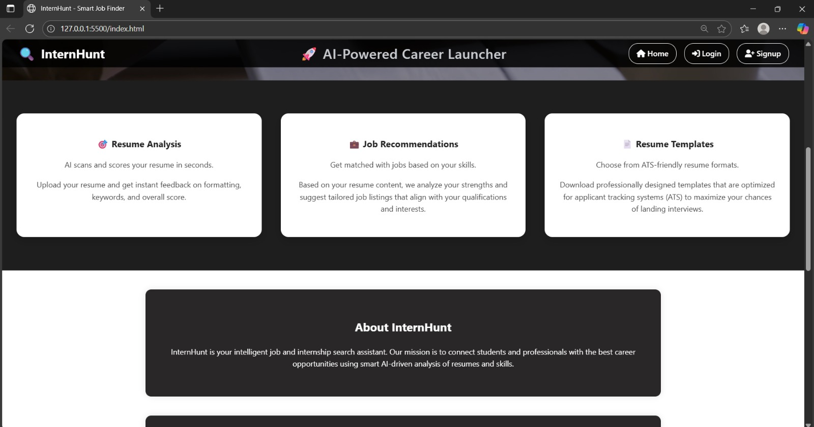
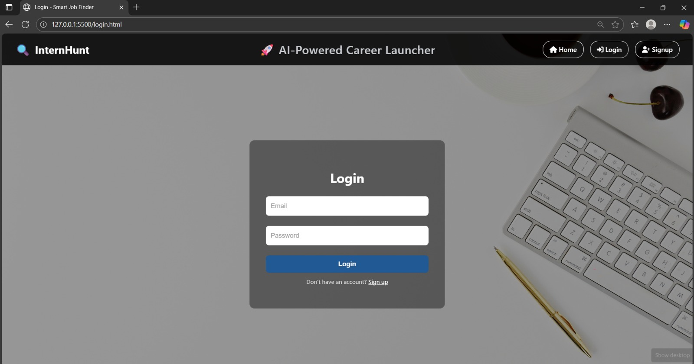
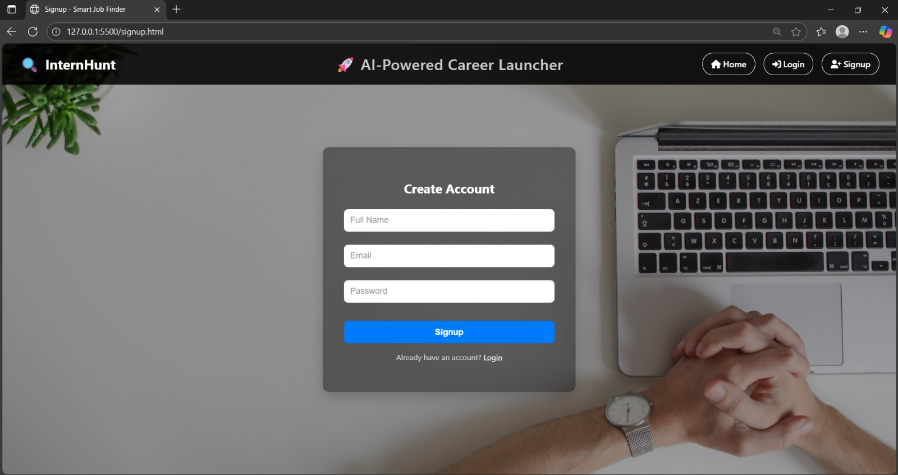
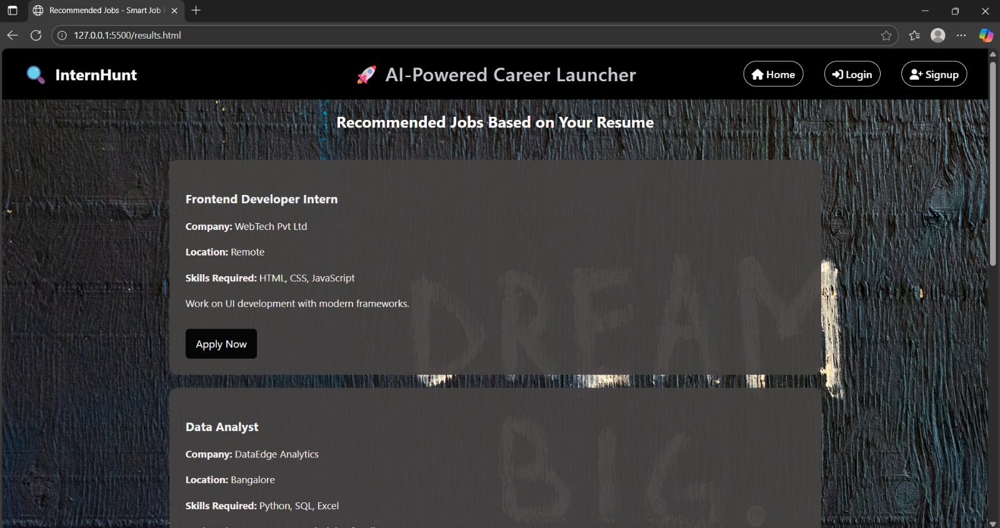
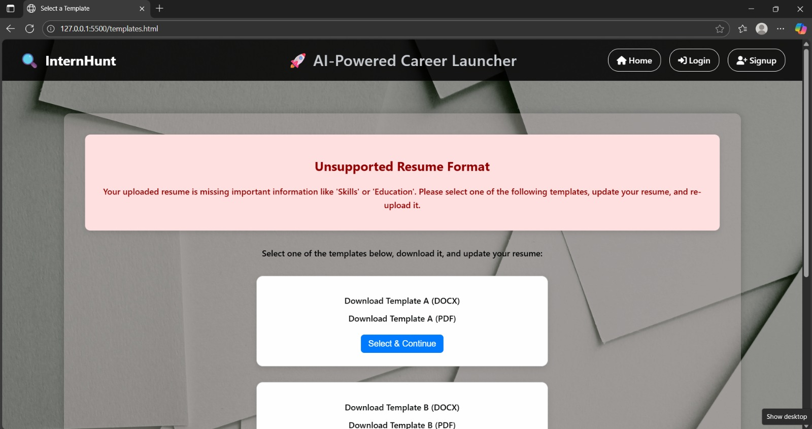

InternHunt 🚀

InternHunt is a smart job & internship finder built with HTML, CSS, and JavaScript. It analyzes uploaded resumes, validates content, and matches users with job listings based on their skills.

🌟 Features

- Resume validation & feedback
- Skill-based job matching using JSON
- Responsive UI with scroll animations
- Resume templates for weak resumes
- LocalStorage-based resume status tracking

📁 Technologies

- HTML5 / CSS3 / JavaScript (ES6)
- LocalStorage & Fetch API
- JSON-based dynamic job rendering

🖼 Screenshots

🔐 Home Page  

🔐 Home Page (Alt View)  

🔐 Login Page  

🔐 Signup Page  

📄 Resume Upload  

💼 Job Recommendations  

🎨 Choose Template  

